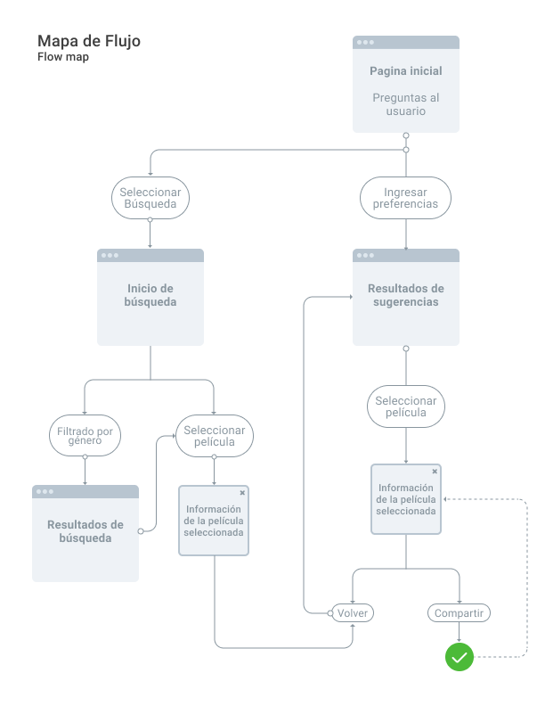
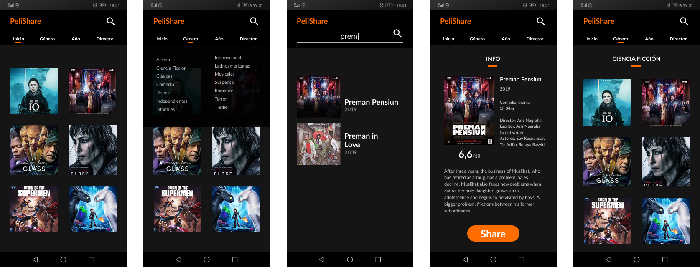
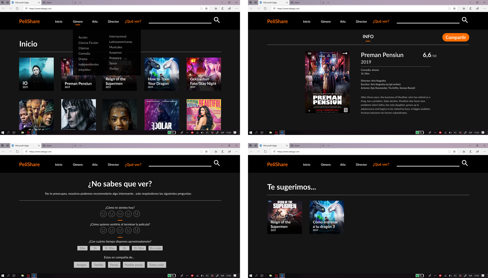
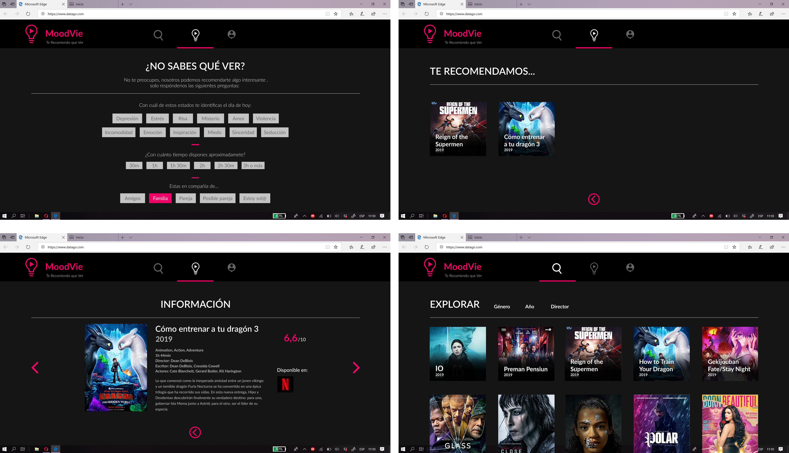
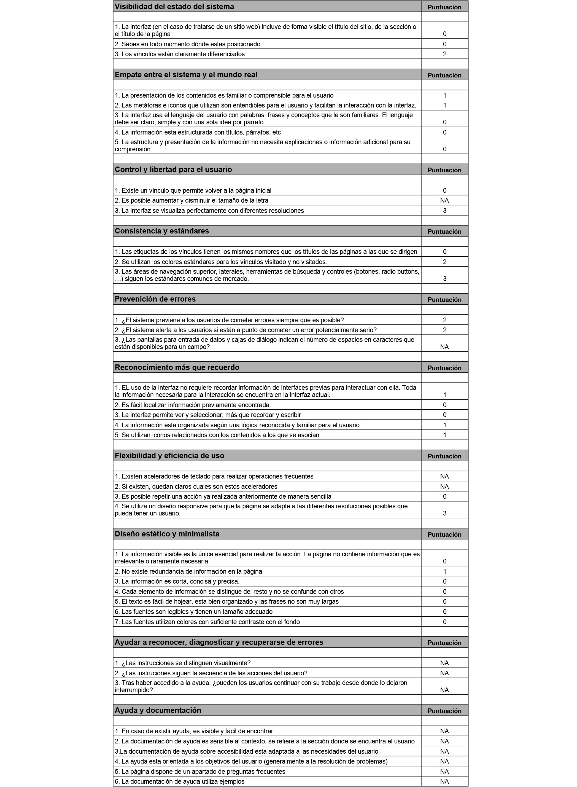

# **"MoodVie" Proyecto Hackathon**
## **Índice**

- Preámbulo
- Definición de usuario
  - Encuestas
  - Usuario (User persona)
  - Historias de Usuario y Definition of Done
- Definición del producto
    - Experiencia
    - Planificación
    - Mapa de flujo
    - Referente
    - Prototipo de baja Fidelidad
    - Prototipo de mediana Fidelidad
- Desarrollo de Interfaz UI
  - Mobile First
  - Flujo de Usabilidad
  - Evaluación Heurística
  - Prototipo de escritorio

  -----------------------------

## **Preámbulo**

 

  Muchas veces nos ha pasado que tenemos muchas ganas de ver una película, pero no sabemos cuál, porque nuestro estado de ánimo no está para ver lo que siempre nos gusta, o porque aveces nuestra compañia no comparte nuestros mismos gustos.

 "MoodVie" es una plataforma para personas que buscan recomendaciones de películas, cuando no saben que ver.
 A través de una serie de preguntas te puede mostrar la película que estabas buscando. 
 
 Mucho más rápido que revisar el catálogo completo de Netflix ¿no?.

## **Definición del Usuario**
-----------------------------
## **Encuestas**

Con los resultados y análisis de las encuestas, se concluyó lo siguiente sobre el usuario promedio:

- La edad promedio es de entre 27 a 32 años.
- Bien podria ser un hombre o una mujer.
- Se condisera un aficionado por el cine.
- Ve peliculas por streaming almenos una vez a la semana.
- Utiliza principalmente Netflix y Torrent.
- Se informa viendo reseñas, criticas y trailers de las películas antes de verlas.
- No siempre ve las películas sugeridas por Netflix ya que no las considera 100% acertivas.
> Puedes ver los resultados de las encuestas en este link de [Drive](https://drive.google.com/drive/folders/124K99SuSnn94D6WJgciJ8eun8Yg0Umzn?usp=sharing)

## **Usuario (User persona)**
Basandonos en los resultados de la encuesta y las conclusiones sobre el usuario promedio, se definió el siguiente User persona.

## **Historias de Usuario y Definition of Done**

Luego de haber definido nuestro Usuario y teniendo sus Necesidades, se trabajarán las siguientes historias de usuario con sus respectivos DoD, los cuales nos ayúdaran en nuestra planificación y desarrollo del prototipo:

**Historia de Usuario 1**

|         COMO   |QUIERO                         |PARA                         |
|----------------|-------------------------------|-----------------------------|
|Persona que no sabe que película ver |` sugerencias de películas` |elegir una que se adecue a mi.|

**Criterios de aceptación**
- [x] Ver sugerencias 
- [x] Sugerencias del gusto del usuario

**Definition of Done**
- [x] Pantalla inicial con preguntas
- [x] Preguntas sobre gustos
- [x] Botónes de seleccion
- [x] Mostrar películas sugeridas

**Historia de Usuario 2**

|         COMO   |QUIERO                         |PARA                         |
|----------------|-------------------------------|-----------------------------|
|Persona a quien le sugirieron películas |`información sobre ellas` |elegir una de mi gusto.|

**Criterios de aceptación**
- [x] Ingresar a la película buscada
- [x] Ver reseña
- [x] Ver calificación
- [x] Ver trailer

**Definition of Done**
- [x] Ver tarjetas de peliculas sugeridas
- [x] Ver tarjeta de pelicula buscada
- [x] Mostrar información de la película al hacer click

-----------------------------

## **Planificación**

A continuación se adjunta el link a nuestra planificación. Cada tarea tiene un número asignado represenando la dificultad y una etiqueta con el nombre de cada persona y un color representativo para indicar las tareas realizadas por cada una de las integrantes.

> La planificación de este Sprint está en el siguiente link de [Trello](https://trello.com/b/xJ7p1rg9/hackatón).

-----------------------------

# **Definición del producto**

## **Mapa de flujo**

Al tener los Definition of Done, o requerimientos de la plataforma, se trabajó un mapa de flujo, para guiarnos en la usabilidad.

## **Referente visual y de Usabilidad**

## **Prototipo de baja Fidelidad**

## **Prototipo de mediana Fidelidad**

> Prototipo interactivo desarrollado en [Figma](https://www.figma.com/proto/GO6JCElExYM7I7KUHOquL1YF/Prototipo-Hackaton?node-id=1%3A865&scaling=contain).

## **Desarrollo de Interfaz UI**
-----------------------------

## **Mobile First**

## **Versión escritorio**
## Diseño UI-1

## Testeos de Usuario UI-1

**Primera UI a testear**

Se le explica a la persona el concepto y funcionamiento de la siguiente forma:

"Esta es una aplicación que te sugiere películas."

----------------------------------------

***Feedback e Insights***

-  Al usuario le parecen extrañas las preguntas sobre como se siente y quiere sentirse. Es probable que sea por las opciones.
- Considera que deberían preguntarsele sus gustos.
- Indica que pareciera que la página trata de otra cosa.
- Le gustaria tener un perfil personalizado.
- Le gustaría ver los trailers.

Cambios para la siguiente Iteración:
 >Cambiar la pantalla de preguntas como principal.

 >Cambiar texto del nav bar por iconos.

 >Cambiar a nombre que tenga que ver con estados del ánimo.

 >Iconos indicarán posición del usuario.

 >Agregar un logo que tenga que ver con "sugerencias, ideas, compartir."

----------------------------------------

 

## Diseño UI-2

Se cambió la pantalla de preguntas al inicio y se agregó un logo. Se cambiaron por iconos los enlaces del nav bar.

> Prototipo interactivo desarrollado en [Figma](https://www.figma.com/proto/aWb326i0NfYfPv8V68ILnuGa/PrototipoHackaton-ITERADO?node-id=0%3A1&scaling=contain).

## **Evaluación Heurística**

----------------------------------------
## **Próximas Iteraciones**

Cambios para la siguiente Iteración:
 >Iterar en las preguntas de intereses.

 >Eliminar exceso de botones.

 >Cambiar orden de iconos, dejando las sugerencias como primera opción.

----------------------------------------
## **Anexo**

Durante la semana de trabajo, tuvimos inconvenientes al momento de realizar el deploy. Por falta de tiempo se tuvo que tomar la decisiónde crear en nuevo repositorio para cumplir con el deploy. Sin embargo se adjunta el link del repositorio anterior para que sean revisadas todas las actvidades relizadas durante la primera parte del proyecto (commits).

https://github.com/olgamperez/hackathon-peliculas1